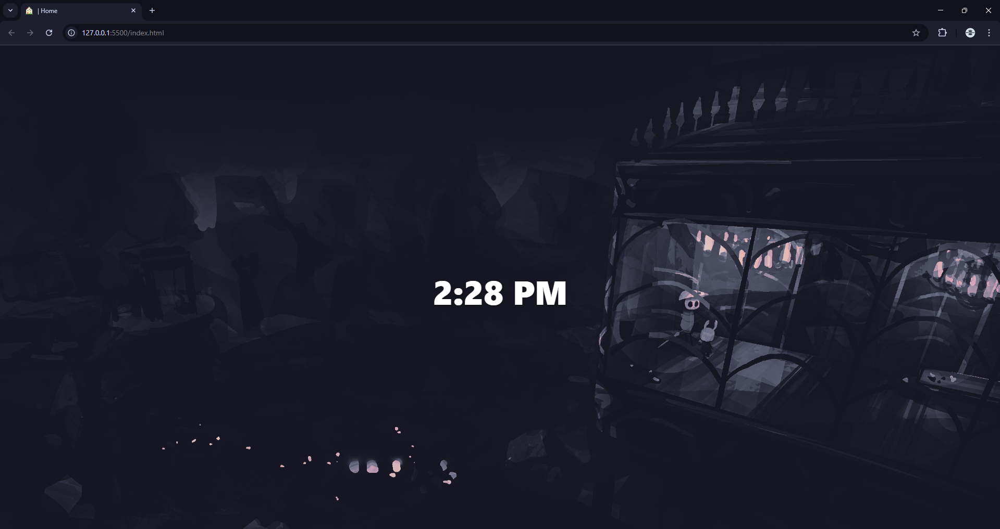

# 🏠 | Home
---

---

## ✨ Features

-  Super Simple
-  No distractions, just a clock
-  Super Lightweight ( HTML + CSS + JS )

---

## 🚀 Usage

# Chrome
Method 1 ( webpage method ) :

- Step 1 : go to " sparsha-bhusal.github.io/home "
- Step 2 : copy url address
- Step 3 : Go to settings [here !](chrome://settings )
- Step 4 : Go to " On Startup "
- Step 5 : Choose " Open a specific page or set of pages "
- Step 6 : Click "Add a new page" and paste

Method 2 ( Extension emthod ) :

- Step 1 : Download the github repo as zip
- Setp 2 : Go to [here !](chrome://extensions/)
- step 3 : Enable Developer Mode (top right)
- Setp 4 : Click "Load unpacked"
- Step 5 : Select the project folder

## 🎯 Why?
I built this to match my minimalist workflow on Linux + Tiling WMs.  
No distractions. Just fast access to what I use daily.

